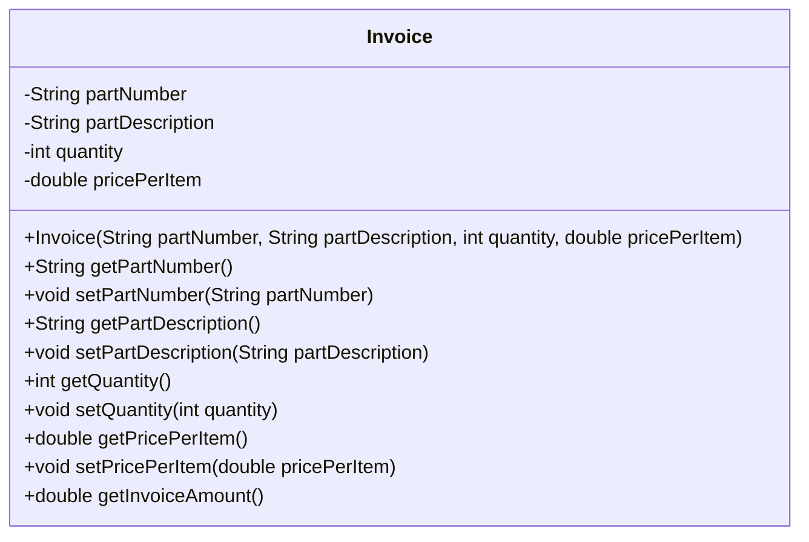

# Exercise 2 — Invoice UML Class Diagram

```mermaid
classDiagram
    class Invoice {
        -String partNumber
        -String partDescription
        -int quantity
        -double pricePerItem
        +Invoice(String partNumber, String partDescription, int quantity, double pricePerItem)
        +String getPartNumber()
        +void setPartNumber(String partNumber)
        +String getPartDescription()
        +void setPartDescription(String partDescription)
        +int getQuantity()
        +void setQuantity(int quantity)
        +double getPricePerItem()
        +void setPricePerItem(double pricePerItem)
        +double getInvoiceAmount()
    }
```
